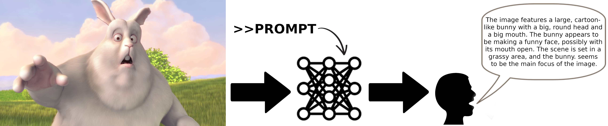
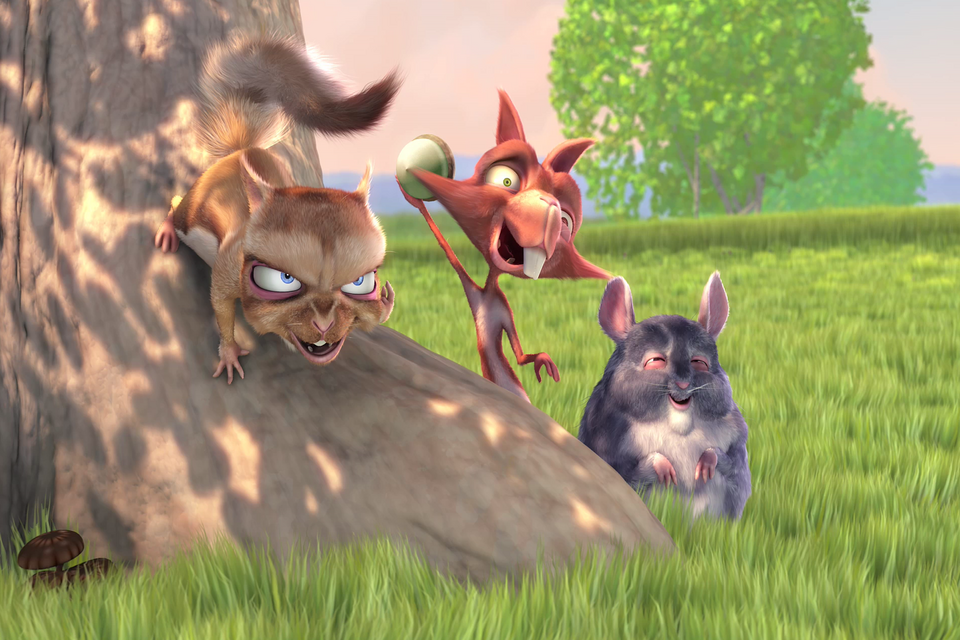
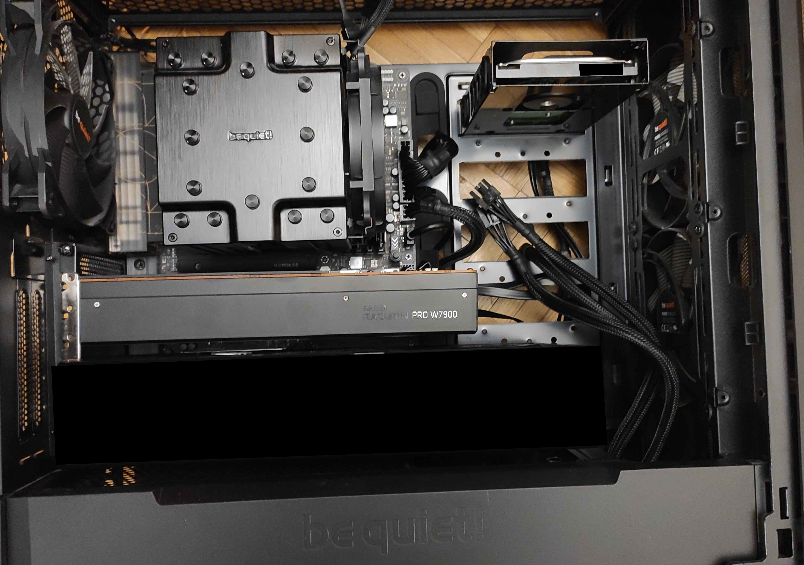
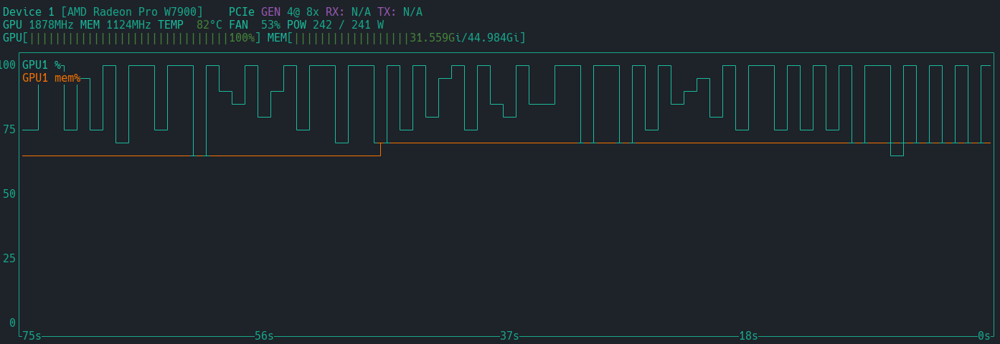

# hackster.io-AI-video-narration-for-visually-impaired

## Introduction

Visual content is almost an inseparable part of the modern digital world. While movies and videos are an important form of entertainment and communication in today's society, those who are visually impaired often miss out on the visual aspects of these mediums.
The problem I aim to address is the lack of accessibility to visual content for visually impaired.
I wanted to create a generative voice narration tool that would describe to the listener the situation happening on the screen.

Main difficulties that can be faced:

- Various content of input movies (many objects of different colors, background types, characters, behaviours, etc.).
- Catching information from nuances and gestures.
- Plot understanding (not only single scene).
- Understanding beginning and ending of the scene.

## Solution

Considering main difficulties mentioned in the previous section it seems that Machine Learning **Transformers** models
may be a quite good approach to face the problem. **Transformers** have immensely developed over the last couple of years.
Many researchers have put their effort into achieving **state-of-the-art** solutions that pushed transformer's capabilities
even further.
For example GPT-4o model that has been released lately is achieving outstanding results.
Therefore, considering the use of **Transformers** seems like a reasonable approach.
Additionally, there are multiple open-source transformer models for images and several for videos over the internet
which are easy to use (after meeting hardware requirements).

The solution I built is an AI-driven video narration system specifically tailored for visually impaired.
Unlike existing solutions, which often rely on pre-recorded audio descriptions my approach offers generative descriptions and availability to everyone.
Ultimately, this improves accessibility for the visually impaired users, providing a more immersive and engaging experience.

My system utilizes technologies such as open-source Large Language Models (LLMs) provided by
[HuggingFace Transformers library](https://huggingface.co/docs/transformers/en/index) for scene interpretation
and Python libraries for scene detection and general video and audio processing.

## Main features of the solution



The above image shows the general idea of the solution:

1. On the left side we can see a shot from the movie "Big Buck Bunny".
2. The shot, along with prepared prompt, is passed to the neural network.
3. The AI model generates a text that describes current situation.
4. Finally, the description is synthesized into a speech and added to the video playback.

In summary, the main features of the solution are:

- Describing video scenes.
- Identification of objects, actions, and scenes.
- Keeping context between scenes.
- Synchronized narration with video playback.

> TODO: keeping context between scenes

## Results

Below is an image with the link to YouTube video that shows the result of processing [Big Buck Bunny](https://www.youtube.com/watch?v=aqz-KE-bpKQ) movie through my system.
Narrator is already embedded into the movie.
Sometimes there is a pause at the beginning of a scene (freeze of the scene's first frame).
This freeze creates space for the narrator to have time to speak.

[](https://www.youtube.com/watch?v=F4pD0IXFhg4)

## Solution Details

Following the idea of "divide and conquer", the solution to the problem is divided into several parts (called stages).
Each stage has its specific task and brings us closer to the result.
The detailed stages of the solution are shown in the image below.


The pipeline is split into the following parts:

1. **Loading a movie** - a movie is being loaded. It requires a path that indicates location of the movie in the local
filesystem.
2. **Splitting into scenes** - indicates frames that are beginnings and endings of the scenes.
[PySceneDetect](https://www.scenedetect.com/) library is used mainly in this stage.
3. **Generating description for every scene** - bases on the results from previous stage.
As it is known when scenes begin and end we can extract frames of particular scene and interpret it.
[Transformers Video-LLaVA](https://huggingface.co/docs/transformers/model_doc/video_llava) model is used to process this task.
One of the most time-consuming parts of this stage is to construct a suitable **prompt** - it expresses our expectations to model.
Well constructed **prompt** improves quality of the descriptions. Description's base language is english.
4. **(Optional step) Translation to other language** - uses [deep_translator.GoogleTranslator](https://deep-translator.readthedocs.io/en/latest/usage.html) to translate english descriptions to other language.
5. **Synthesizing text description to voice description** - Converts descriptions from previous stages to audio voice narration.
Uses [TTS](https://pypi.org/project/TTS/) Python library to process this task. Particularly xtts_v2 model is used.
This model requires speaker voice reference to clone the voice tone.
Example narrator voice samples are included in **voice_samples/** directory.\
Currently supported languages: Polish (pl), English (en).\
**Adding custom voice samples** can be easily done and is described in [How to add custom voice sample](#how-to-add-a-custom-voice-sample) section.
6. **Adding synthesized voice to original movie** - utilizes [ffmpeg](https://linux.die.net/man/1/ffmpeg) tool to add synthesized voices into movie in the proper
moments. Sometimes there is not enough space in particular scene for the synthesized voice to talk.
In that case the initial frame of the scene is being frozen for a short duration of time to create required space.
Additionally, detection of the first speech moment in the scene is implemented to avoid a situation where the narrator overlaps with the speech of some other character from that scene.

### Project Structure

General project structure can be defined as follows:

- Each stage is implemented as a class.
- Each class has a defined interface (*...Interface.py* file).
- Interfaces ensure that implemented class will be a modular part of the system.
  - They enable to easily implement and test different implementations of particular class.
  - They define methods that must be implemented in particular class.
  - Those methods ensure continuity of connection between components (solid pipeline).


```shell
project/
├── environment.yml  # contains configuration file for conda environment
├── freezed_req.txt  # informative only - frozen versions of libraries. Cannot be pip installed because of ROCm
├── main.py
├── misc_requirements.txt  # contains Python libraries installed from default repositories
├── torch_requirements.txt  # contains PyTorch libraries that need to be installed from external repository (ROCm)
├── README.md
│
├── doc/  # documentation related files
│
├── StagesProcessor/
│   ├── StagesProcessor.py
│   │   StagesProcessorInterface.py
│   │
│   ├── ClipDescribing/
│   │   ├─ ClipDescriptorInterface.py
│   │   └─ ClipDescriptors.py
│   │
│   ├── MovieComposing/
│   │   ├─ MovieComposerInterface.py
│   │   └─ MovieComposers.py
│   │
│   ├── MovieHandling/
│   │   ├─ MovieHandlerInterface.py
│   │   └─ MovieHandlers.py
│   │
│   ├── ScenesDetecting/
│   │   ├─ SceneDetectorInterface.py
│   │   └─ SceneDetectors.py
│   │
│   ├── Translating/
│   │   ├─ TranslatorInterface.py
│   │   └─ Translators.py
│   │
│   └── VoiceSynthesizing/
│       ├─ VoiceSynthesizerInterface.py
│       └─ VoiceSynthesizers.py
│   
├── utils/
│   └─ LogHandling/
│      └─ LogHandlers.py  # informative logging (colors in terminal etc.)
│
└── voice_samples/  # contains samples for voice synthesizing
```

### Prompt Construction (examples with results)

Correct prompt is crucial to obtain desired descriptions.
This section shows examples of prompts with results (descriptions).
Its aim is to visualise the process of creating desired prompt.

#### 1. The most basic prompt

```python
...
prompt = "USER: <video>\nWhat's the content of the video?\nDESCRIPTION:"
...
# Results:
# Scene 1: The video features a beautiful landscape with a field of green grass, a forest of trees, and a sky with clouds. The scene is serene and peaceful, with a sense of tranquility.
# Scene 2: The video features a grassy area with a small stream of water flowing through it. The stream is surrounded by grass and rocks, and there are several flowers in the area.
# Scene 3: The video features a small bird sitting on a branch of a tree. The bird is seen looking at the camera and then flying away. The video also includes a title screen and a closing screen.
# Scene 4: The video shows a large, furry creature lying in a grassy area. It appears to be a cartoon or animated character, and it is positioned in a way that makes it look like it is sleeping.
# Scene 5: The video features a large white rabbit standing in a grassy field, with a tree in the background. The rabbit appears to be looking at the camera, and it seems to be a computer-generated image.
# Scene 6: The video features a large white rabbit standing on a cloudy blue sky background. The rabbit is seen smiling and waving, and it appears to be enjoying the moment.
# Scene 7: The video features a large, fluffy white bunny rabbit with big, expressive eyes and a big smile. The rabbit is standing in front of a tree and appears to be enjoying the sunshine.
# Scene 8: The video features a white rabbit standing in a field of white flowers. The rabbit is seen eating the flowers and looking at the camera.
# Scene 9: The video features a large white bunny standing in a field of grass, surrounded by purple flowers. The bunny is seen standing on its hind legs and waving its front paws in the air.
# Scene 10: The video shows a small animal, possibly a dog, standing on a branch of a tree. The animal is looking at the camera, and there is a pink object in the grass nearby.
# Scene 11: The video features a white cat with blue eyes, a smile, and a big nose, standing in a field of white flowers. The cat is seen eating the flowers and looking at the camera.
# Scene 12: The video features a white bunny rabbit with purple wings and a butterfly on its head. The rabbit is laying on the grass, and the butterfly is flying above it.
# Scene 13: The video features a large, white bunny holding an apple in its hand and standing in a field. The bunny is surrounded by a variety of colorful flowers, and there are trees in the background.
# Scene 14: The video features a white polar bear standing next to a tree with red fruits on it. The polar bear is seen eating the fruits from the tree.
# Scene 15: The video features a large bunny rabbit standing in a field of grass, with a tree in the background. The rabbit is holding a red apple in its mouth, and it appears to be enjoying the fruit.
# Scene 16: The video shows a white bunny rabbit standing in a grassy field. The rabbit is seen eating grass and looking around the area. The video also features a tree with green leaves and a purple flower.
# Scene 17: The video features a large, white, furry creature with big ears and a big smile. The creature is standing in a grassy field and is holding a butterfly in its hand.
# Scene 18: The video shows a white sheep standing in a field of grass, with a purple butterfly flying nearby. The sheep appears to be looking at the butterfly, and the butterfly is flying in the air.
# Scene 19: The video features three cartoon animals standing in a grassy field, with one of them holding a football. The animals are likely from the movie "Ice Age" and are engaging in playful behavior.
# Scene 20: The video features a white rabbit with big ears and a purple butterfly flying towards it. The rabbit is standing under a tree, and the butterfly is flying towards the rabbit.
# Scene 21: The video features a squirrel sitting on a tree branch, looking at the camera. The squirrel then jumps off the branch and runs away.
# Scene 22: The video features a large white rabbit and a small brown rabbit interacting with each other. The large rabbit is seen hanging from a tree branch while the small rabbit is sitting on the ground.
# Scene 23: The video shows a sheep standing in a field of grass.
# Scene 24: The video features a group of cartoon animals, including a cat, a dog, and a fox, who are playing together in a grassy field.
# Scene 25: The video features a large, white, fluffy bunny rabbit standing in a grassy field. The rabbit appears to be looking at the camera and appears to be making a funny face.
# Scene 26: The video features a group of animated animals, including a squirrel, a cat, and a rat, who are interacting with each other in a grassy field.
# Scene 27: The video features a large, fluffy bunny rabbit with big, expressive eyes and a big, fluffy body.
# Scene 28: The video features three animated characters, two of which are squirrels and one of which is a rat. The squirrels are standing on a rock, while the rat is standing on the ground.
# Scene 29: The video features a large, white, furry bunny rabbit with big, black eyes and a big, black nose. The rabbit is standing in a field of grass and appears to be yawning.
# Scene 30: The video features three animated animals, two squirrels and a rat, who are playing together in a grassy field. The squirrels are seen holding a nut and a toy, while the rat is also holding a nut.
# Scene 31: The video features a large, fluffy bunny rabbit standing in a field, with a cloudy sky in the background. The rabbit is wearing a red bow on its head and appears to be smiling.
# Scene 32: The video features a group of animated animals, including a squirrel, a cat, and a dog, who are all standing on a rock.
# Scene 33: The video features a large, white, and fluffy bunny rabbit walking through a field of grass. The rabbit is seen eating a carrot while walking, and it appears to be enjoying the carrot.
# Scene 34: The video features a group of squirrels playing with a ball in a field. One of the squirrels is holding the ball in its mouth, while the other two are standing on the ground.
# Scene 35: The video features a small animal, possibly a rodent, with big eyes and a big mouth, standing on a rock and looking at a butterfly.
# Scene 36: The video features a large, fluffy bunny rabbit standing in a field of grass. The rabbit is holding a pumpkin in its mouth and appears to be enjoying the fall season.
# Scene 37: The video features a character from the movie "Bears" who is holding a butterfly. The character is seen smiling and laughing while holding the butterfly.
# Scene 38: The video features a large, white, furry creature with big, black eyes and a big, black nose. The creature is seen standing in a grassy field, and it appears to be yelling at the camera.
# Scene 39: The video features a cartoon character, a red squirrel, who is seen holding a white object in its mouth. The squirrel is seen with its mouth open, and it appears to be yawning.
# Scene 40: The video features a large, white, and furry rabbit with big, black eyes, standing in a grassy field.
# Scene 41: The video features a cat and a butterfly interacting with each other. The cat is seen chasing the butterfly, and the butterfly is seen flying around the cat.
# Scene 42: The video features a large, furry creature with big ears and a big mouth, standing in a field.
# Scene 43: The video features a red animal with a purple butterfly in its mouth, standing in a grassy field. The animal is seen holding the butterfly in its mouth, and it appears to be a cartoon character.
# Scene 44: The video features a large, white, furry creature with big ears and a big mouth, standing in a field. The creature appears to be yelling or shouting, and its mouth is open.
# Scene 45: The video features a cartoon character, a red creature with wings, standing in a field and interacting with a dog. The character is seen standing in front of a tree, and the dog is seen looking at the character.
```

Problems:

- Description is a bit too long (narrator will to talk too long).
- Description start with "The video", "The scene" phrases.
- Multiple camera reference ("at the camera").

#### 2. Skipping auxiliary words

```python
...
prompt = (f"CURRENT SCENE: <video>\n"
          "TASK: Directly describe the scene without starting with auxiliary words or helping verbs. "
          "DESCRIPTION:")
...
# Results:
# Scene 1: A field of green grass with trees in the background.
# Scene 2: The image features a grassy area with a small stream flowing through it. The stream is surrounded by a variety of plants, including a large flower and a small flower.
# Scene 3: A small bird is perched on a branch of a tree.
# Scene 4: A large, furry, and fluffy dog is laying down in a grassy area.
# Scene 5: A large white rabbit is standing in a grassy field.
# Scene 6: A large white rabbit is standing on a cloudy blue sky.
# Scene 7: A large white bunny with a big smile on its face is standing in front of a tree.
# Scene 8: A white rabbit is standing in a field of white flowers.
# Scene 9: A large white bunny is standing in a field of grass with purple flowers.
# Scene 10: A small animal is standing on a branch of a tree, looking down at a white animal laying on the ground.
# Scene 11: A large, white, fluffy, and happy-looking cat is standing in a field of white flowers. The cat is smiling and appears to be enjoying the flowers.
# Scene 12: A white bunny with purple wings is laying on the grass. A butterfly is flying above it.
# Scene 13: A large white rabbit is standing in a field with a red apple in its hand.
# Scene 14: A tree with green leaves and red fruits is in the foreground, while a white statue is in the background.
# Scene 15: A large white rabbit is standing in a field of grass, surrounded by a variety of flowers. The rabbit is holding a red apple in its mouth.
# Scene 16: A white bunny is sitting in the grass under a tree.
# Scene 17: A large white bunny with big ears and a big smile is standing in a field with a butterfly flying above him.
# Scene 18: A white bunny rabbit is sitting in a field of grass. There are two other bunnies in the field, one of which is standing and the other is sitting. The bunnies are surrounded by trees and a sky background.
# Scene 19: Three cartoon animals are standing in a grassy field. One of them is holding a ball.
# Scene 20: A white rabbit is standing under a tree with a purple butterfly flying above it.
# Scene 21: A small brown animal is sitting on a tree trunk.
# Scene 22: A large white rabbit is sitting under a tree, and a small brown rabbit is sitting on the tree branch above the white rabbit.
# Scene 23: A white sheep is standing in a green field.
# Scene 24: Three cartoon animals are sitting in a grassy field. One is a cat, another is a dog, and the third is a rabbit. They are all looking at the camera.
# Scene 25: A large white bunny is standing in a field of grass.
# Scene 26: Three cartoon animals are standing on a rock in a field.
# Scene 27: A large, fluffy bunny with big, round ears and a big, round belly is standing in a field. The bunny has a big, round mouth and is making a funny face.
# Scene 28: Three cartoon animals are standing in a grassy field. One of them is a squirrel, and the other two are rodents. They are all looking at the camera.
# Scene 29: A large, white, furry bunny with big, black eyes and a big, black nose is standing in a field.
# Scene 30: Three cartoon animals are standing in a grassy field. One is a squirrel, another is a cat, and the third is a dog. They are all looking at the camera.
# Scene 31: A large, fluffy white bunny with a red bow on its head is standing in a field of grass.
# Scene 32: A group of three small animals are standing on a rock, with one of them looking at the camera.
# Scene 33: A large, white, furry creature with a bunny-like face and a black spot on its head is walking through a field of yellow flowers.
# Scene 34: Two squirrels are playing with a ball in a field.
# Scene 35: A small brown animal with a big smile is holding a large pink butterfly in its paws.
# Scene 36: A large, white, furry rabbit is standing in a field of grass, surrounded by various fruits and vegetables.
# Scene 37: A large, furry creature with a big smile on its face is holding a pink butterfly in its hand.
# Scene 38: A large, white, furry bunny with big, black eyes and a big, black nose is standing in a field of grass. The bunny is making a face and appears to be yelling.
# Scene 39: A cartoon character with a red and brown furry body is holding a white object in its paws. The character has a big smile on its face and is looking at the camera.
# Scene 40: A large white bunny with big ears and a big mouth is standing in a field. The bunny is pointing at something with its right hand.
# Scene 41: A cat is standing in front of a tree, and a butterfly is flying towards it.
# Scene 42: A large, furry, and fuzzy bunny rabbit is standing in a field of grass. The rabbit is looking down at the ground and appears to be in distress.
# Scene 43: A red animal with a purple butterfly in its mouth is standing in a field.
# Scene 44: A large, white, furry creature with big ears and a big mouth is standing in a field. It is looking at the camera and appears to be yelling.
# Scene 45: A cartoon character is standing in a field with a dog. The character is holding a purple object in its hand.
```

Successes:

- Description do not start with "The video...", "The scene..." phrases.

Problems:

- Description is still a bit too long.
- Multiple camera reference ("at the camera")

#### 3. Removing camera reference - 2 prompts

Many attempts of trying to remove camera reference by modifying initial prompt came to nothing. 
I tried other solution - second prompt that clearly says only to rephrase given description to skip camera reference.
Results below.

```python
...
prompt = (f""
          "CURRENT SCENE: <video>\n"
          "TASK: Directly describe the scene without starting with auxiliary words or helping verbs. "
          "Remove camera references. "
          "\nDESCRIPTION:")
...

current_descriptions = ...

...
prompt2 = (f"TEXT: {current_descriptions}. "
           f"TASK: rephrase given TEXT so it does not contain camera reference."
           f"\nRESULT:")
...
# Results:
# Scene 1: A field of green grass with trees in the background.
# Scene 2: The image features a grassy area with a small stream flowing through it. The stream is surrounded by a variety of plants, including a large flower and a small flower.
# Scene 3: A small bird is perched on a branch of a tree.
# Scene 4: A large, furry, and fluffy dog is laying down in a grassy area.
# Scene 5: A large white rabbit is standing in a grassy field.
# Scene 6: A large white rabbit is standing on a cloudy blue sky.
# Scene 7: A large white bunny with a big smile on its face is standing in front of a tree.
# Scene 8: A white rabbit is standing in a field of white flowers.
# Scene 9: A large white bunny is standing in a field of grass with purple flowers.
# Scene 10: A small animal is standing on a branch of a tree, looking down at a white animal laying on the ground.
# Scene 11: A large, white, fluffy, and happy-looking cat is standing in a field of white flowers. The cat is smiling and appears to be enjoying the flowers.
# Scene 12: A white bunny with purple wings is laying on the grass. A butterfly is flying above it.
# Scene 13: A large white rabbit is standing in a field with a red apple in its hand.
# Scene 14: A tree with green leaves and red fruits is in the foreground, while a white statue is in the background.
# Scene 15: A large white rabbit is standing in a field of grass, surrounded by a variety of flowers. The rabbit is holding a red apple in its mouth.
# Scene 16: A white bunny is sitting in the grass under a tree.
# Scene 17: A large white bunny with big ears and a big smile is standing in a field with a butterfly flying above him.
# Scene 18: A white bunny rabbit is sitting in a field of grass. There are two other bunnies in the field, one of which is standing and the other is sitting. The bunnies are surrounded by trees and a sky background.
# Scene 19: Three cartoon animals are standing in a grassy field. One of them is holding a ball.
# Scene 20: A white rabbit is standing under a tree with a purple butterfly flying above it.
# Scene 21: A small brown animal is sitting on a tree trunk.
# Scene 22: A large white rabbit is sitting under a tree, and a small brown rabbit is sitting on the tree branch above the white rabbit.
# Scene 23: A white sheep is standing in a green field.
# Scene 24: Three cartoon animals are sitting in a grassy field. One is a cat, another is a dog, and the third is a rabbit. They are all looking in the same direction.
# Scene 25: A large white bunny is standing in a field of grass.
# Scene 26: Three cartoon animals are standing on a rock in a field.
# Scene 27: A large, fluffy bunny with big, round ears and a big, round belly is standing in a field. The bunny has a big, round mouth and is making a funny face.
# Scene 28: Three cartoon animals are standing in a grassy field. One of them is a squirrel, and the other two are rodents. They are all looking in the same direction.
# Scene 29: A large, white, furry bunny with big, black eyes and a big, black nose is standing in a field.
# Scene 30: Three cartoon animals are standing in a grassy field. One is a squirrel, another is a cat, and the third is a dog. They are all looking in the same direction.
# Scene 31: A large, fluffy white bunny with a red bow on its head is standing in a field of grass.
# Scene 32: Three small animals are standing on a rock, with one of them looking at the viewer.
# Scene 33: A large, white, furry creature with a bunny-like face and a black spot on its head is walking through a field of yellow flowers.
# Scene 34: Two squirrels are playing with a ball in a field.
# Scene 35: A small brown animal with a big smile is holding a large pink butterfly in its paws.
# Scene 36: A large, white, furry rabbit is standing in a field of grass, surrounded by various fruits and vegetables.
# Scene 37: A large, furry creature with a big smile on its face is holding a pink butterfly in its hand.
# Scene 38: A large, white, furry bunny with big, black eyes and a big, black nose is standing in a field of grass. The bunny is making a face and appears to be yelling.
# Scene 39: A cartoon character with a red and brown furry body is holding a white object in its paws. The character has a big smile on its face and is looking at the viewer.
# Scene 40: A large white bunny with big ears and a big mouth is standing in a field. The bunny is pointing at something with its right hand.
# Scene 41: A cat is standing in front of a tree, and a butterfly is flying towards it.
# Scene 42: A large, furry, and fuzzy bunny rabbit is standing in a field of grass. The rabbit is looking down at the ground and appears to be in distress.
# Scene 43: A red animal with a purple butterfly in its mouth is standing in a field.
# Scene 44: A large, white, furry creature with big ears and a big mouth is standing in a field. It is looking at something and appears to be yelling.
# Scene 45: A cartoon character is standing in a field with a dog. The character is holding a purple object in its hand.
```

### Working with AMD Radeon PRO W7900 (quick summary)

The image below shows the AMD Radeon PRO W7900 installed in my PC.
The GPU does not take up too much space.\
However, I was surprised that this GPU needs 3 slots to be installed. In my opinion, 2 would be enough.\
I saw on the internet that AMD has already figured this out and created a 2-slot version.



Here are my obervations about working with AMD Radeon PRO W7900:

- It is important to make sure that GPU is well ventilated during work.
- The temperature sets at level of 82 °C under load (see the chart below).
- The noise level is acceptable (it's pretty quiet).
- Power consumption at 100% of usage sets below 250 W - doesn't require powerful power supply.



## Example usage

### Generate clip with narration

Here are several command line examples showing how to add narration to a clip.

```shell
python3 main.py --fp CLIP_PATH.mov  # this will create CLIP_PATH_en.mov file in the given clip directory (beside CLIP_PATH.mov file)
python3 main.py --fp CLIP_PATH.mov --out_dir /home/$USER/videos  # this will create CLIP_PATH_en.mov file in the /home/$USER/videos directory
```

Processing a clip may take various amount of time. But to bring the values closer
I will give an example of processing [Big Buck Bunny](https://www.youtube.com/watch?v=aqz-KE-bpKQ) movie:

- Original video duration: 596 s (9 min 56 sec).
- Number of detected scenes: 129.
- Processing time: 965 s (16 min 5 sec).

It seems that number of detected scenes is the key factor influencing processing time.\
The system has its limitations regarding acceptable length of the film due to [PyDub library]((https://github.com/jiaaro/pydub)) limitations.
I tried to process full length movie (1h 23min) and there were some issues related to audio decoding process.

### How to select a language

\
[Designed by Freepik](http://www.freepik.com)

When launching *main.py* script you can **add *--languages* flag** multiple times. This will create a list of required languages.\
**Language** that you are setting **must be available** for [deep_translator.GoogleTranslator](https://deep-translator.readthedocs.io/en/latest/usage.html) for translation stage and
**must have set up its voice sample** (described in [How to add a custom voice sample](#how-to-add-a-custom-voice-sample) section below).\
To check available languages and their abbreviations run following `python` script (based on: [source](https://deep-translator.readthedocs.io/en/latest/usage.html#check-supported-languages)).

```python
# pip install deep_translator
from deep_translator import GoogleTranslator
langs_dict = GoogleTranslator().get_supported_languages(as_dict=True)
# output: {"arabic": "ar", "french": "fr", "english": "en" etc...}
```

For every required language the system will create one output file with narration.\
**Setting particular language multiple times** will cause program to generate narration for particular language
**only once** as the initial list of requested languages is converted to set (which reduces the amount of repeating elements to 1).\
**Not setting** *--languages* flag at all will generate **only english** narration by default.

```shell
# Below command will create CLIP_PATH_pl.mov file in the given clip directory 
# (beside CLIP_PATH.mov file). This file will have polish (pl) narration.
python3 main.py --fp CLIP_PATH.mov --languages pl

# Below command will create CLIP_PATH_pl.mov and CLIP_PATH_en.mov files in the given clip directory (beside CLIP_PATH.mov file). 
# These files will have polish (pl) and english (en) narration.
python3 main.py --fp CLIP_PATH.mov --languages pl --languages en
```

### How to add a custom voice sample

\
If you want to introduce a new language to be available to use or you want to substitute particular voice sample with
one prepared by yourself you need to:

1. Add your voice sample to [voice_samples/](voice_samples) directory.

    Voice sample should not be too short nor too long.
    Currently [en.wav](voice_samples/en.wav) lasts 5 seconds and [pl.wav](voice_samples/pl.wav) lasts 4 seconds. What may be difficult to achieve is:
    - **Clean voice** - clean articulation of each tone without mumbling.
    - **Clean background** - clearing noises from the background helps voice synthesizing algorithm to extract tone and
    reduce artifacts in synthesized speech.
    - For more detailed information view [xtts guide](https://blog.unrealspeech.com/xtts-v2-ultimate-guide/).

2. Modify **LANGUAGE2READER** dictionary in [VoiceSynthesizers.py](StagesProcessor/VoiceSynthesizing/VoiceSynthesizers.py) file where:
    - **Key** is indicator of the language you want to use. It must match one of [deep_translator.GoogleTranslator supported languages](https://deep-translator.readthedocs.io/en/latest/usage.html#check-supported-languages)
    or their abbreviations.
    - **Value** is the path indicating voice sample file (preferably placed inside [voice_samples/](voice_samples) directory)
    you want to use with language indicated by **Key**.

    ```python
    # StagesProcessor/VoiceSynthesizing/VoiceSynthesizers.py
    # Modifying LANGUAGE2READER dictionary
    ...
    import os
    READERS_FOLDER = os.path.join('./voice_samples/')
    LANGUAGE2READER = {
        'en': os.path.join(READERS_FOLDER, 'en.wav'),
        'pl': os.path.join(READERS_FOLDER, 'pl.wav')
    }
    ...
    ```

## Used hardware and software (BOM)

The main part of this project is the AMD Radeon PRO W7900 card.
To take the full advantage of it, I used the following setup:

Hardware:

- AMD Radeon PRO W7900 GPU
- AMD Ryzen 9 7950X
- 1000W power supply
- 64GB DDR5 RAM running at 5200 MT/s
- 2TB M.2 PCIe Gen4x4 NVMe SSD

Software:

- OS: Linux (tried Ubuntu 22.04.4 LTS and Manjaro)
- AMD ROCm Software
- Deep learning framework - PyTorch for AI development
- Essential computer vision and natural language processing libraries:
  - [OpenCV](https://github.com/opencv/opencv-python)
  - [Transformers](https://huggingface.co/docs/transformers/index)
  - [Pydub](https://github.com/jiaaro/pydub)
  - [PySceneDetect](https://www.scenedetect.com/)
- Video playback software with synchronization capabilities ([VLC media player](https://www.videolan.org)).

All required Python packages are listed in requirements files:

- [PyTorch requirements](torch_requirements.txt)
- [Other requirements](misc_requirements.txt)

## Environemnt setup

The guide shows how to install AMD GPU drivers and ROCm software.
It also walks through Conda installation and environment setup.

### AMD GPU drivers and ROCm installation

For this project I use Linux only.
The first step is to install AMD GPU drivers and ROCm stack and this process varies between different Linux distributions.
You will find the official description here: <https://rocm.docs.amd.com/projects/install-on-linux/en/latest/how-to/amdgpu-install.html>

> List of system requirements and supported GPUs:
> <https://rocm.docs.amd.com/projects/install-on-linux/en/latest/reference/system-requirements.html>

I tried 2 distributions: Ubuntu 22.04.4 LTS and Manjaro.
Here is how I did it:

---

### [Ubuntu 22.04.4 LTS](https://releases.ubuntu.com/jammy/)

Install drivers and libraries like in the [quickguide](https://rocm.docs.amd.com/projects/install-on-linux/en/latest/tutorial/quick-start.html):

```shell
sudo apt update
sudo apt install "linux-headers-$(uname -r)" "linux-modules-extra-$(uname -r)"
sudo usermod -a -G render,video $LOGNAME # Add the current user to the render and video groups
wget https://repo.radeon.com/amdgpu-install/6.1.2/ubuntu/jammy/amdgpu-install_6.1.60102-1_all.deb
sudo apt install ./amdgpu-install_6.1.60102-1_all.deb
sudo apt update
sudo apt install amdgpu-dkms rocm
```

> [!IMPORTANT]
> Now you will need to restart your system.

And that is all! :sunglasses:

---

### [Manjaro (Plasma desktop)](https://manjaro.org/download/)

This distribution is not officially supported by AMD, but it is not a problem at all.
The Arch repository covers all needed packages, just install `rocm-hip-sdk` via Pamac GUI or run this in terminal:

```shell
sudo pacman -Sy rocm-hip-sdk
```

The packages I installed:

```shell
Packages (42) cmake-3.29.3-1  comgr-6.0.2-1  composable-kernel-6.0.2-1  cppdap-1.58.0-1  hip-runtime-amd-6.0.2-4  hipblas-6.0.2-1  hipcub-6.0.2-1  hipfft-6.0.2-1  hiprand-6.0.2-1  hipsolver-6.0.2-1  hipsparse-6.0.2-1  hsa-rocr-6.0.2-2  hsakmt-roct-6.0.0-2  jsoncpp-1.9.5-2
              libuv-1.48.0-2  miopen-hip-6.0.2-1  numactl-2.0.18-1  opencl-headers-2:2024.05.08-1  openmp-17.0.6-2  rccl-6.0.2-1  rhash-1.4.4-1  rocalution-6.0.2-2  rocblas-6.0.2-1  rocfft-6.0.2-1  rocm-clang-ocl-6.0.2-1  rocm-cmake-6.0.2-1  rocm-core-6.0.2-2
              rocm-device-libs-6.0.2-1  rocm-hip-libraries-6.0.2-1  rocm-hip-runtime-6.0.2-1  rocm-language-runtime-6.0.2-1  rocm-llvm-6.0.2-1  rocm-opencl-runtime-6.0.2-1  rocm-smi-lib-6.0.2-1  rocminfo-6.0.2-1  rocprim-6.0.2-1  rocrand-6.0.2-1  rocsolver-6.0.2-1
              rocsparse-6.0.2-2  rocthrust-6.0.2-1  roctracer-6.0.2-1  rocm-hip-sdk-6.0.2-1
```

Optionally install an additional app for reporting system info:

```shell
sudo pacman -Sy rocminfo
```

The version I used:

```shell
Packages (1) rocminfo-6.0.2-1
```

> [!IMPORTANT]
> After successful installation reboot the system.

---

### Installation verification

Verify drivers installation to ensure you can see your GPU:

Command:

```shell
rocm-smi --showproductname
```

My result on Ubuntu 22.04:

```text
============================ ROCm System Management Interface ============================
====================================== Product Info ======================================
GPU[0]  : Card Series:   0x7448
GPU[0]  : Card Model:   0x7448
GPU[0]  : Card Vendor:   Advanced Micro Devices, Inc. [AMD/ATI]
GPU[0]  : Card SKU:   D7070100
GPU[0]  : Subsystem ID:  0x0e0d
GPU[0]  : Device Rev:   0x00
GPU[0]  : Node ID:   1
GPU[0]  : GUID:   19246
GPU[0]  : GFX Version:   gfx11000
GPU[1]  : Card Series:   0x164e
GPU[1]  : Card Model:   0x164e
GPU[1]  : Card Vendor:   Advanced Micro Devices, Inc. [AMD/ATI]
GPU[1]  : Card SKU:   RAPHAEL
GPU[1]  : Subsystem ID:  0x8877
GPU[1]  : Device Rev:   0xc1
GPU[1]  : Node ID:   2
GPU[1]  : GUID:   9773
GPU[1]  : GFX Version:   gfx1036
==========================================================================================
================================== End of ROCm SMI Log ===================================
```

My result on Manjaro:

```text
============================ ROCm System Management Interface ============================
====================================== Product Info ======================================
GPU[0]          : Card series:          Navi 31 [Radeon Pro W7900]
GPU[0]          : Card model:           0x0e0d
GPU[0]          : Card vendor:          Advanced Micro Devices, Inc. [AMD/ATI]
GPU[0]          : Card SKU:             D7070100
GPU[1]          : Card series:          Raphael
GPU[1]          : Card model:           0x8877
GPU[1]          : Card vendor:          Advanced Micro Devices, Inc. [AMD/ATI]
GPU[1]          : Card SKU:             RAPHAEL
==========================================================================================
================================== End of ROCm SMI Log ===================================
```

Command:

```shell
rocminfo
```

My result on Ubuntu 22.04:

Expect something like this:

```shell
ROCk module version 6.7.0 is loaded
=====================
HSA System Attributes
=====================
Runtime Version:         1.13
Runtime Ext Version:     1.4
System Timestamp Freq.:  1000.000000MHz
Sig. Max Wait Duration:  18446744073709551615 (0xFFFFFFFFFFFFFFFF) (timestamp count)
Machine Model:           LARGE
System Endianness:       LITTLE
Mwaitx:                  DISABLED
DMAbuf Support:          YES

[...]
```

Look for the GPU entry:

```shell
[...]

*******
Agent 2
*******
  Name:                    gfx1100
  Uuid:                    GPU-ecff3f5547b240c7
  Marketing Name:          AMD Radeon PRO W7900
  Vendor Name:             AMD
  Feature:                 KERNEL_DISPATCH
  Profile:                 BASE_PROFILE
  Float Round Mode:        NEAR
  Max Queue Number:        128(0x80)
  Queue Min Size:          64(0x40)
  Queue Max Size:          131072(0x20000)
  Queue Type:              MULTI
  Node:                    1
  Device Type:             GPU

[...]
```

My result on Manjaro:

Expect something like this:

```shell
ROCk module is loaded
=====================
HSA System Attributes
=====================
Runtime Version:         1.1
System Timestamp Freq.:  1000.000000MHz
Sig. Max Wait Duration:  18446744073709551615 (0xFFFFFFFFFFFFFFFF) (timestamp count)
Machine Model:           LARGE
System Endianness:       LITTLE
Mwaitx:                  DISABLED
DMAbuf Support:          YES

[...]
```

Look for the GPU entry:

```shell
[...]

*******
Agent 2
*******
  Name:                    gfx1100
  Uuid:                    GPU-ecff3f5547b240c7
  Marketing Name:          AMD Radeon Pro W7900
  Vendor Name:             AMD
  Feature:                 KERNEL_DISPATCH
  Profile:                 BASE_PROFILE
  Float Round Mode:        NEAR
  Max Queue Number:        128(0x80)
  Queue Min Size:          64(0x40)
  Queue Max Size:          131072(0x20000)
  Queue Type:              MULTI
  Node:                    1
  Device Type:             GPU

[...]
```

Helpful resources:

- [Arch Linux Wiki on AMD GPU drivers and ROCm installation](https://wiki.archlinux.org/title/GPGPU#ROCm)
- [PyTorch installation command generator](https://pytorch.org/get-started/locally/)
- [An AMD blog post about running LLaVa on ROCm with an example](https://rocm.blogs.amd.com/artificial-intelligence/llava-next/README.html)
- [An AMD post about running Transformers on ROCm](https://huggingface.co/amd)

The drivers installation phase is done and we can proceed to the environment setup.

---

### Conda installation

The conda is used to separate the Python environment and make it independent of the used operating system.
Look at this [site](https://docs.anaconda.com/anaconda/install/linux/) to get into details.

Download the Anaconda installation script.

```shell
wget https://repo.anaconda.com/archive/Anaconda3-2024.02-1-Linux-x86_64.sh
```

Run it. Accept all default options, but at the end allow to initialize conda.

```shell
bash Anaconda3-2024.02-1-Linux-x86_64.sh
```

Allow to initialize:

```text
conda config --set auto_activate_base false

You can undo this by running `conda init --reverse $SHELL`? [yes|no]
[no] >>> yes
```

> [!NOTE]
> Re-open the terminal to continue.
>
> ```text
> ==> For changes to take effect, close and re-open your current shell. <==
> ```

If you use Zsh (default for Manjaro KDE Plasma), then the conda may automatically initialize only for Bash in the `~/.bashrc` file.
To fix it, find the Anaconda installation path and open Zsh terminal.
This will append the `~/.zshrc` file and initialize conda on every Zsh launch:

```shell
<conda-installation-path>/anaconda3/bin/conda init zsh
```

If the installation path was default, then it may look like this:

```shell
~/anaconda3/bin/conda init zsh
```

Check if conda works with the example command.
It lists installed packages in a conda environment:

```shell
conda list
```

### Conda environment setup

Now create and activate a new conda environment:

```shell
conda env create -f environment.yml
conda activate ai-video-narration-for-visually-impaired-rocm
```

Display your environments to ensure it was activated.
If you haven't had any before, then you should see only `base` and `ai-video-narration-for-visually-impaired-rocm`.

```shell
conda env list
```

Example result, the asterisk `*` means currently activated environment:

```text
# conda environments:
#
base                     /home/<user>/anaconda3
ai-video-narration-for-visually-impaired-rocm  *  /home/<user>/anaconda3/envs/ai-video-narration-for-visually-impaired-rocm
```

### Conda installing packages

All packages should be installed during the environment setup.

To check if PyTorch sees any of your GPUs, run `python` CLI and paste this:

```python
import torch
print(f"Torch version: {torch.__version__}")
print(f"Is CUDA available?: {torch.cuda.is_available()}")
print(f"Number of GPUs: {torch.cuda.device_count()}")
for i in range(torch.cuda.device_count()):
    print(f"index: {i}; device name: {torch.cuda.get_device_name(i)}")
```

My result:

```text
(ai-video-narration-for-visually-impaired-rocm) <user>@<user>-computer:~/Downloads$ python
Python 3.10.14 (main, May  6 2024, 19:42:50) [GCC 11.2.0] on linux
Type "help", "copyright", "credits" or "license" for more information.
Torch version: 2.3.1+rocm6.0
Is CUDA available?: True
Number of GPUs: 2
index: 0; device name: AMD Radeon PRO W7900
index: 1; device name: AMD Radeon Graphics
```

If you see more than one GPU device, you may need to export [`HIP_VISIBLE_DEVICES`](https://rocm.docs.amd.com/en/latest/conceptual/gpu-isolation.html#hip-visible-devices) variable to your environemnt every time before launching Python.
This may resolve potential conflicts and solve the problem of inappropriate GPU selection.

> [!IMPORTANT]
> Firstly check the index of your GPU like we did it in Python, it may be other than 0!

```shell
export HIP_VISIBLE_DEVICES=0
```

Now you should see only one GPU device:

```text
(ai-video-narration-for-visually-impaired-rocm) <user>@<user>-computer:~/Downloads$ python
Python 3.10.14 (main, May  6 2024, 19:42:50) [GCC 11.2.0] on linux
Type "help", "copyright", "credits" or "license" for more information.
Torch version: 2.3.1+rocm6.0
Is CUDA available?: True
Number of GPUs: 1
index: 0; device name: AMD Radeon PRO W7900
```

In my case, the CPU's embedded GPU was also seen by PyTorch and it caused some troubles, which stopped me for a while.
The errors weren't suggestive enough (the closest one I got was when I run [the Docker example](https://rocm.blogs.amd.com/artificial-intelligence/llava-next/README.html)), but the web search has found the solution for me. You may look at these links:

- <https://github.com/pytorch/pytorch/issues/119637>
- <https://www.reddit.com/r/ROCm/comments/17e2b5o/rocmpytorch_problem/>
- <https://rocm.docs.amd.com/projects/HIP/en/docs-6.0.0/how_to_guides/debugging.html#making-device-visible>

Resources:

- Check out this official [guide](https://huggingface.co/amd) for ROCm dependent Python libraries.
- [`Transformers`](https://huggingface.co/docs/transformers/index) library page,

### Other resources

PyTorch for ROCm in Docker:

<https://rocm.docs.amd.com/projects/install-on-linux/en/latest/how-to/3rd-party/pytorch-install.html>

## Observe hardware usage

### gpustat

```shell
gpustat -a -i 0.5
```

Arguments explaination:

- `-a` - Display all gpu properties above
- `-i 0.5` - Run in watch mode (equivalent to watch gpustat) if given. Denotes interval between updates.

### radeontop

```shell
sudo pamac install radeontop
radeontop
```

### htop

Standard command line program that helps to observe CPU usage.

```shell
htop -d 10
```

Arguments explaination:

- `-d 10` - Delay between updates, in tenths of a second. If the delay value is less than 1,
            it is increased to 1, i.e. 1/10 second. If the delay value is greater than 100,
            it is decreased to 100, i.e. 10 seconds.

### btop

Very nice GUI interface to observe CPU usage

```shell
sudo snap install btop
```

### nvtop

Install it via:

#### `pacman` on Manjaro

```shell
sudo pacman -Sy nvtop
```

#### `snap` on Ubuntu 22.04 LTS

```shell
sudo snap instal nvtop
```

If you will try with `apt` then you may encounter this error while running `nvtop`:

```text
nvtop: ./src/extract_gpuinfo_amdgpu.c:324: initDeviceSysfsPaths: Assertion `gpu_info->hwmonDevice != NULL' failed.
Aborted (core dumped)
```

It is caused by the outdated version of that is in `apt` repository.

## Ending

My solution involves testing multiple Large Language Model architectures to determine the most suitable one.
During this process, I assessed potential limitations of the AMD Radeon PRO W7900 GPU when working with these models.
The results of these tests are documented in the project summary.

The efficiency of our visual narration system relies heavily on high-performance GPUs with sufficient VRAM to ensure smooth interpretation speed, measured in FPS (frames per second). Training AI models for such systems demands substantial compute capability. The AMD Radeon PRO W7900 GPU, boasting 48 GB of VRAM and offering 61 TFLOPS for float32 or 122 TFLOPS for float16 aligns with these requirements. Opting for a stationary solution over a cloud-based one enabled us to utilize local data, minimizing network usage and overhead, especially considering the potentially large sizes of the datasets involved, often exceeding 150 GB.

## License

[Big Buck Bunny](https://peach.blender.org/) is licensed under the
[Creative Commons Attribution 3.0 license](http://creativecommons.org/licenses/by/3.0/).

(c) copyright 2008, Blender Foundation / <www.bigbuckbunny.org>
